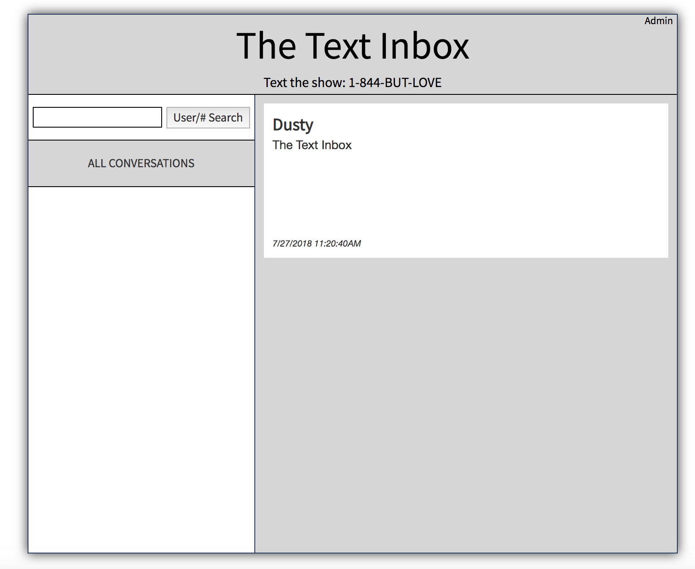

# The Text Inbox

Experimental application designed to replace existing text inbox application for [The Morning After](http://insidestl.com/radio-shows/the-morning-after) radio show.

Allows for two views - one, a normal view that allows anyone to view incoming texts and usernames, and an admin view which allows the admin user to view and edit phone numbers and names.

www.thetextinbox.com

## Setup Instructions

* Copy the `docker.env.sample` to `docker.env`
* Fill in your secret values
* `docker-compose build`
* `docker-compose up -d`
* Run `docker exec -it thetextinbox_db_1 psql -d postgres -U postgres` and once
  in run `create database thetextinbox;`. Exit the docker shell afterwards
* Run `docker exec -it thetextinbox_web_1 python create.py`
